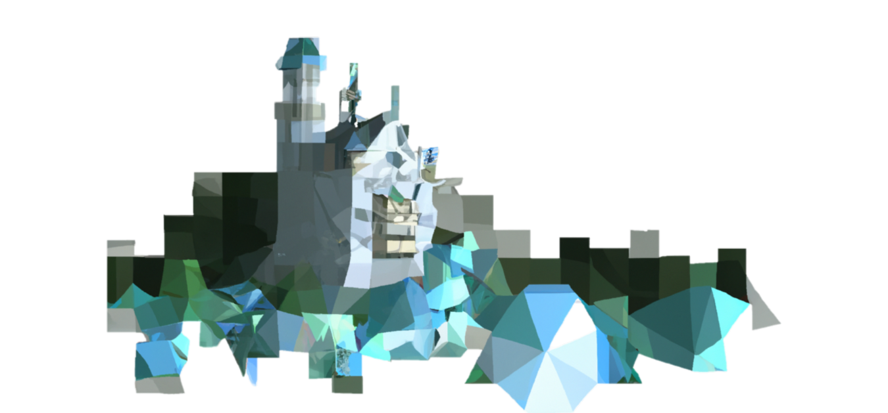

#  LandmarkNER - Identify Bavarian Landmarks in Text

This repo contains code to identify landmarks in subtitles from videos of Bayerischer Rundfunk (BR). To this end a custom Named Entity Recognition (NER) model was trained in [spaCy](https://spacy.io/). The model uses the [pretrained German transformer pipeline (bert-base-german-cased)](https://spacy.io/models/de#de_dep_news_trf) included in spaCy. An NER pipeline for [de_dep_news_trf](https://spacy.io/models/de#de_dep_news_trf) was created and fine-tuned on a corpus of annotated subtitles (annotated using [prodigy](https://prodi.gy/)). Due to legal restrictions the initial subtitle files and corpus are not included in this repo. 

## Scripts 

* [Create the corpus](scripts/create_corpus.py) from subtitle .txt files
* [Create a pattern.jsonl file](scripts/create_patterns.py) from a collection of landmark names
* [Create initial NER training data](scripts/create_initial_train_data.py) from corpus and [patterns](data/patterns.jsonl) 
* [Custom prodigy annotation recipce](recipes/ner_correct_spans.py)

## Notebooks

* [Training notebook](notebooks/NER_spaCy_de_trf_3_3.ipynb) for fine-tuning of [pretrained German transformer pipeline (bert-base-german-cased)](https://spacy.io/models/de#de_dep_news_trf)
* [Multimodal landmark extraction notebook](notebooks/OWL_ViT+LandmarkNER+mGenre.ipynb) for combined analysis of video and text

## Data 

* [pattern](data/patterns.jsonl) dictionary of landmark names
* [train data](spaCy_training_files/train.spacy)
* [validation data](spaCy_training_files/dev.spacy)
* [test data](spaCy_training_files/test.spacy)
* [base config](config/base_config_trf_spacy32.cfg) for training of transformer ner

## Usage

You can adapt the scripts to a custom NER label of your choice. Start by [creating a corpus](scripts/create_corpus.py) from .txt files. Then, [create a pattern.jsonl file](scripts/create_patterns.py) from a collection of example labels. From this, you [create training data](scripts/create_initial_train_data.py) for an initial model. You train this initial model by using the [spaCy command line interface](https://spacy.io/usage/training). Next, you correct the initial model's predictions on the corpus with the [custom prodigy annotation recipce](recipes/ner_correct_spans.py) to generate high-quality NER training data. Split into [training data](spaCy_training_files/train.spacy) and [validation data](spaCy_training_files/dev.spacy). With these data, you can fine-tune the German BERT model. For this project, the LandmarkNER model was [fine-tuned in a notebook](notebooks/NER_spaCy_de_trf_3_3.ipynb) in [GoogleColab](https://colab.research.google.com), using the [base config](config/base_config_trf_spacy32.cfg). Finally, [create a test data corpus](scripts/create_corpus.py) from fresh subtitles and fully annotate them with the standard prodigy recipe [ner.manual](https://prodi.gy/docs/recipes#ner-manual). [Evaluate](https://spacy.io/api/cli#evaluate) your model on the test set.

## Model 

The trained LandmarkNER model is available on the [Hugging Face hub](https://huggingface.co/constantinSch/LandmarkNER)

To disambiguate detected entities to Wikipedia titles [mGenre](https://github.com/facebookresearch/GENRE) can be used. The resulting pipeline can be tested in an [interactive Web App on Hugging Face Spaces.](https://huggingface.co/spaces/constantinSch/LandmarkNER_EL)

## PoC for multimodal video unterstanding

Furthermore, this model is used in a proof of concept for the extraction of the landmark names and frames of landmarks from a video, using time-code-associated descriptive texts or subtitles. [OWL-ViT (an open-vocabulary object detection model)](https://arxiv.org/pdf/2205.06230) is used as a building detector. The text is analyzed with the LandmarkNER model, its output is disambiguated for Wikipedia titles by mGenre](https://github.com/facebookresearch/GENRE). For timecodes at which a building is detected in the video by [OWL-ViT](https://arxiv.org/pdf/2205.06230) and the name of a landmark is detected in the text, the frames and the associated landmark names are extracted. The [proof of concept notebook](notebooks/OWL_ViT+LandmarkNER+mGenre.ipynb) can be executed in Colab.
## License

[MIT License](LICENSE.md)

